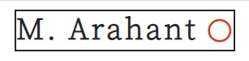
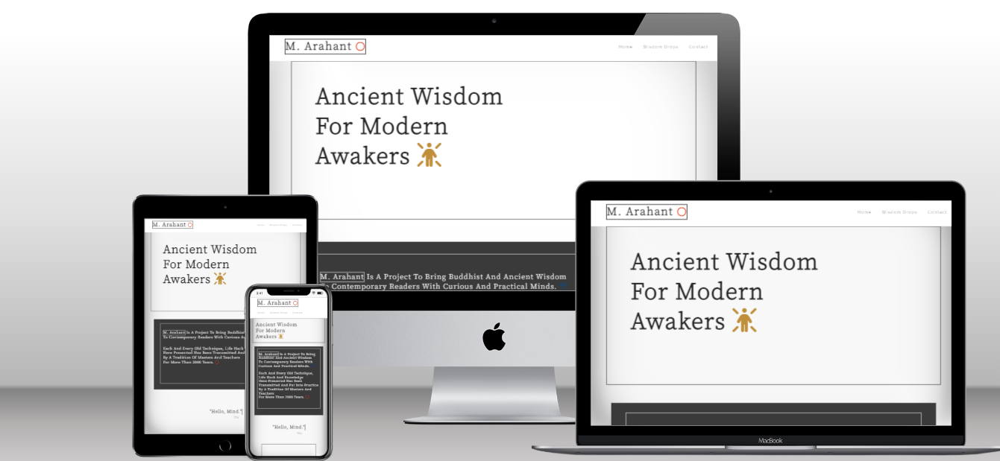
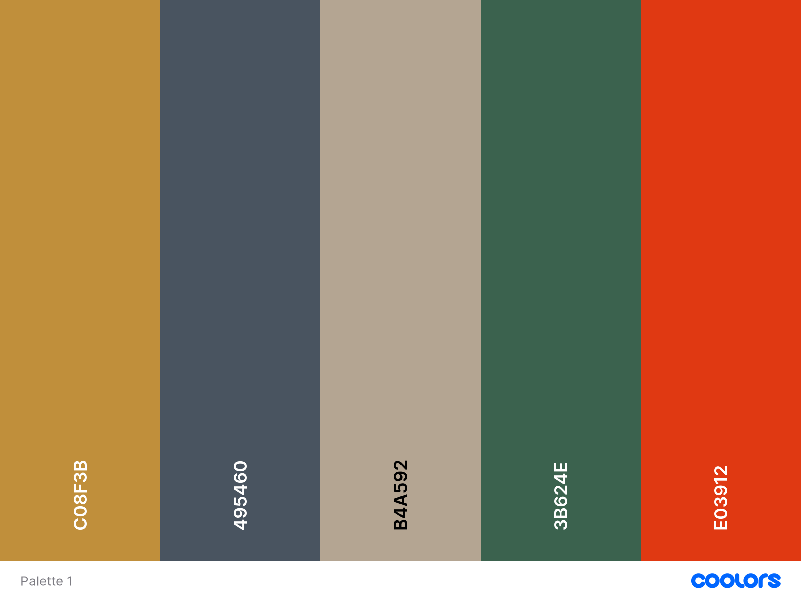
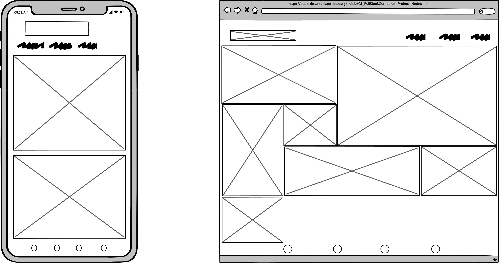

## Table of Contents
* [Overview](#overview)
* [UX](#ux)
  * [User stories](#user-stories)
    * [First Time Visitor Goals](#first-time-visitor-goals)
    * [Returning Visitor Goals](#returning-visitor-goals)
  * [Structure](#structure)
  * [Design](#design)
    * [Colour Scheme](#colour-scheme)
    * [Typography](#typography)
    * [Imagery](#imagery)
    * [Wireframes](#wireframes)
    * [Discrepancies to Design](#discrepancies-to-design)
* [Limitations](#limitations)
- [Features](#features)
    * [Existing Features](#existing-features)
* [Technologies](#technologies)
* [Testing](#testing)
* [Deployment](#deployment)
    * [Run Locally](#run-locally)
* [Credits](#credits)
  * [Content](#content)
  * [Media](#media)
  * [Acknowledgements](#acknowledgements)

## Overview

>**Arahant**  
The term arhat (Sanskrit) or arahant (Pali) denotes for Buddhism a being who has reached a state of perfection and enlightenment. The term has been thought to derive from pre-Buddhist contexts in India, where it signified a “worthy” being. 
(__Oxford Bibliographies__)*

M. Arahant is a fictitious Project to connect modern people to ancient knowledge with a focus on Buddhism. The core of what is today called Buddhism is based mostly on logical and psychological observations on matters that permeate our everyday reality. Concepts like the nature of the mind, concentration and exercises to train one's perception of these same are examples of the practical knowledge described in such teachings.

The idea of the project is to bring all these contents through the website, apps and Study-center.

## M. Arahant 

This project was conceived for the completion of the first Milestone project for the Code Institute's Full Stack Developer course. It was developed using the skills and knowledge acquired of the languages HTML and CSS in the same mentioned course. 

The link to the live website can be found [here](https://eduardo-antoniassi-lobato.github.io/CI_FullStackCurriculum-Project-1/).

*** 
## UX

### User stories
## First-Time Visitor Goals
#### As a first-time user I want:
* the main purpose of the Website is to be clear and direct.
* to navigate and find the contents easily.
* the design of the Website to be coherent with the aim of the project and appealing to the visitor.
* be able to visit and view the website on my mobile device.
* to connect with and visit the social media of the project to keep up to date with the activities of the centre and website.

## Returning Visitor Goals
#### As a return/ frequent visitor I want :
* to keep reading new and interesting content provided by the project.
* to be able to establish contact and possibly request further information on the topics of the Website.

### Structure
The website consists of three pages:
* Home Page: Where the idea of the project is presented straight away with different kinds of visual stimuli, always to emulate the Buddhistic and Zen worlds.
* Wisdom-drops-Page: Where the content created and synthesized by the project will be accessed through clickable images.
* Contact page: Where the visitor will be guided to the different possibilities of interaction with the staff of the project. Be it through the web, with a form to be filled up, a link to the apps developed by the project, or a personal visit to the project's centre. 

Every Page has a sticky navigation bar to facilitate access to the contents. The links to social Media can as well be found on all pages when scrolling down till the end of the same.

### Design

The Website was designed to have a minimalistic and simple layout according to the ideas of the M. Arahant Project. The simple rectangular-shaped borders applied throughout the website, including the logo in the Navigation bar, are thought to echo the likewise rectangular-shaped sheets from which the sutras and Buddhist texts are read at temples and monasteries.

Since the website is based on the same texts of the tradition, the main idea of the design of the page was to imagine a huge Tabula Rasa, where the texts would be posted and output in a modern and minimalist way, always connected to its origins.

#### Colour Scheme

The white colour is associated with knowledge and learning in the Tibetan tradition and is the basic colour for the Website for the same reason. The #252525 colour was used for the fonts over the white and brighter backgrounds to keep the text always easy to read, but not overtly black and fitting to the pastel tones of the Website.

### Palette of Colours

The palette of colours would resemble both the Tibetan and Zen types of expression with its pastel tenses: The first with a more colourful and bright spectrum and the second often looking for simplicity and austerity. 
The simplicity of the Zen was for the most part applied to the big elements of the websites, like boxes and most images on the contact page, whilst the "Tibetan" tones were used more discreetly unto the smaller elements, such as the orange circle in the logo, the golden icon in the hero image and the many other icons throughout the pages.
### Typography
The Source Sans Pro font family was here applied to give the website a modern, succinct,  but slightly traditional visage. 
### Imagery
The logo was built using photoshop and carries the meaning of modern Arahant.

The orange circle stands for the eternal and continuous transmission of knowledge and wisdom. Orange is the colour of enlightenment itself.

The images used in this project were all gathered from the Unsplash website. They were collected due to their meaningful connection to the text that would serve as a link as well as due to its particular tone of colour, not to be in dissonance with the design concept of the project.  

### Wireframes
Home Page 

Wisdom-drops Page 

Contact Page 

### Discrepancies in Design
The design was first developed for the mobile device for the sake of understanding the complexities of the colours and forms on an uprising scale. Since this was my first project in this direction, it would be easier to insert and develop new elements on a bigger screen afterwards than the other way around. Unfortunately, the rectangular-shaped text boxes were not always possible to be applied in the mobile version. Except for the logo being placed over the links, the navbar and footer remained practically the same for the mobile and desktop versions on all pages.  The images and texts of the home page though were placed in the mobile version as a continuous flow of objects, when scrolled down. The grid imagined in the wisdom drops page was inevitably only possible in the desktop version.

### Limitations
Due to the scope of this project, which was to practice the knowledge acquired of the languages of HTML and CSS, no Javascript functionalities were here applied and therefore the contact form will not store data or send email requests. 

## Visual Effects   

### Navbar

The elements in the navbar present a hover effect over the letters to provide a subtle yet visible resemblance to the Sanskrit lettering.

### Hello, Mind

This small animation is the only section with no border on the home page and is connected with the famous first line written by every programmer on code. Hello, world. The animation and keyframes features on CSS were here applied to reach the final result. 

### Grid

The grid effect was used in the wisdom-drops page for the modern contour that it naturally brings as well as for its strait-forward applicability. The images with a strong and pronounced colour were adapted in their shapes on the grid layout in order not to disturb the whole assemblage of the section.
***
## Features
 
### Existing Features

- Navbar - Each page has a sticky navbar to facilitate navigation and access to the different contents of the website.
- Footer - Every page has a footer at the bottom with links to the home page and various social media to establish contact with the project.
- Contact Form - This can be completed on the contact page and is used to contact the project with any queries one may have.
- Grid Gallery - In the wisdom-drops page a grid gallery was used as links for the texts created by the project. The Grid feature provides an easily applied responsive layout and viewport control for the different kinds and sizes of the screen that might be used to visit the website.
- Embedded Google Maps - To facilitate access to the localities of the project and take part in the regular activities a Google maps interface was embedded in the contact page.

## Technologies

* HTML
    * HTML was the main language used to complete the structure of the Website.
* CSS
    * The Website was built with pure CSS to form its styles. No frameworks were here used.

* [Google Fonts](https://fonts.google.com/)
    * Google fonts are used throughout the project to import the *Source Sans Pro* font.
* [Font Awesome](https://fontawesome.com/)
    * Font Awesome Icons are used for the links contained in the website.
* [Visual Studio Code](https://code.visualstudio.com/)
    * VS Code is the Integrated Development Environment used to develop the Website.   
* [GitHub](https://github.com/)
    * GitHub is the hosting site to store the source code for the Website.
* [Git Pages](https://pages.github.com/) 
    * was used for the deployment of the live Website.
* [Gitpod](https://gitpod.io/)
    * The project was written and tested in the IDE.
* [Git](https://git-scm.com/)
    * was used as version control software to commit and push the code to the repository where the source code is now stored.
* [balsamiq Wireframes](https://balsamiq.com/wireframes/)
    * was used to create the wireframes for the design.
* [Google Chrome Developer Tools](https://developers.google.com/web/tools/chrome-devtools)
    * Google chromes built-in developer tools were used to inspect the page elements and help debug issues with the site layout and test the CSS.
* [Adobe Photoshop](https://www.adobe.com/)
    *Adobe Photoshop was here applied to build the logo and modify the tone of colour of some of the images.
* [Coolors](https://coolors.co/)
    * Were used to create the palette of colours for the Website.
***
## Testing

All Testing documentation and outcomes can be found under [TESTING.md](TESTING.md).

***
## Deployment

The project was deployed to GitHub using the following steps:

1. Log into [GitHub](https://GitHub.com/).
2. Select [Eduardo-Antoniassi-Lobato/M.-Arahant](https://github.com/Eduardo-Antoniassi-Lobato/M.-Arahant) from the repositories' list.
3. Select "Settings" from the Repositories sub-headings.
4. Under code and automation select the option "Pages".
5. From the dropdown list under the "Source" heading, select "master".
6. The second drop-down menu that appears should remain as "/root".
7. Press Save. 
8. On Page refresh, the link to the deployed site will be available right at the top of the page.

As this project was developed on the master branch, all changes made to the repository are immediately reflected in the deployed project.

### Run Locally
1. Log into GitHub  [Repository:](https://github.com/Eduardo-Antoniassi-Lobato/M.-Arahant)
2. Click the Code drop-down menu.
3. Copy Git URL from the HTTPS dialogue box that will show up or download the ZIP file, unpackage locally and open with the IDE of choice.
4. Open IDE of choice. 
5. Open a terminal window in a directory of choice.
1. Type 'git clone' command in the terminal followed by the git URL.
1. A clone of the project will be created locally.

***
## Credits
### Code
* To resolve issues of the embedded Google Maps on the contact page, the code used was found on [Stackoverflow](https://stackoverflow.com/questions/71015597/take-url-to-open-larger-map-from-iframe).

* For the creation of the animation section on the Home page, the code written was inspired by this [Stackoverflow](https://stackoverflow.com/questions/40474100/css-typing-effect) post. 

* The animation coded in the Wisdom-drops page was based on this [article](https://blog.logrocket.com/creating-smoother-css-transitions-animate-css-grid/) from LogRocket.

### Content
All contents of the Website were created by the developer.

### Media
All Photographs used on the Website were sourced from [Unsplash](https://unsplash.com/).
* The logo and the images of the website were improved and sometimes modified with [Adobe Photoshop](https://www.adobe.com/)

### Acknowledgements

Many thanks to my mentor Ronan McClelland, for helping me on the project with encouragement and thorough technical guidance. 
