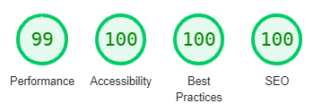
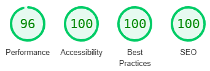
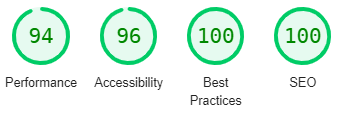

# M. Arahant - Testing Documentation

Main README documentation [README.md](README.md)

[Link to the live Website.](https://eduardo-antoniassi-lobato.github.io/CI_FullStackCurriculum-Project-1/)

# Table of contents

>1. [User Stories](#user-stories)
>2. [Features](#features)
>3. [Browser Testing](#browser-testing)
>4. [Automated Testing](#automated-testing)

 
# Table of contents

>1. [User Stories](#user-stories)
>2. [Features](#features)
>3. [Browser Testing](#browser-testing)
>4. [Automated Testing](#automated-testing)

# User Stories
## As a first-time user I want:
### the main purpose of the Website to be clear and direct.
* The idea and purpose of the website are expressed right after the hero image with a brief text.

### to navigate and find the contents easily.
* The NavBar is the first accessible Feature of the website and provides easy access to all pages of the Website.

### the design of the Website to be coherent with the aim of the project and appealing to the visitor.
* The design of the Website is as clean and minimalistic as possible with modern resemblances to the Buddhistic iconography

### be able to visit and view the website on my mobile device.
* The Website is fully Responsive.

### to connect with and visit the social media of the project to keep up to date with the activities of the centre and website.
* Links to every social media of the project are easily reachable through the footer present on each page.

## As a return/ frequent visitor I want :
### to keep reading new and interesting content provided by the project.
* On the Wisdom-drops page the visitor can find the content regularly provided by the project.

### to be able to establish contact and possibly request further information on the topics of the Website.
* The contact page enables the visitor to establish contact with the project.  

# Features

The features were all tested individually and manually as follows: 

## Navigation bar (Navbar)

All functionalities for the Navbar were tested on every page.

* All links within the navbar were tested in every possible order to ensure correct functionality:
    * Home -> Wisdom-drops // Home -> contact 
    * Wisdom-drops -> Home // wisdom-drops -> contact
    * contact -> Home // contact -> wisdom-drops
* the logo on each page, as well to ensure it diverts the user back to the _"Home"_ page.
* ensure Navbar elements (logo/links) maintain their position through the navigation of the site.
* ensure all links maintain the desired overline effect.
* ensure the Navbar keeps its position on smaller vertical viewports.
* ensure the logo and links reposition themselves dynamically to maintain their correct position.
* ensure the Navbar collapses on small horizontal viewports with the logo positioned over the links. 
* When the collapsed Navbar is displayed, ensure the dropdown does not overflow onto the Viewport Control/content of the page.
* ensure the navigation links display the appropriate effect when hovered over(border-top):
* ensure the links display the expected effects when touched (mobile/tablet):

## Footer

All functionalities for the footer were tested on every page.

* ensure that the first link redirects to the home page. 
* except for the first link, ensure that every link opens a new page on the browser. 
* ensure that the links connect to Facebook, Twitter, Youtube and Instagram respectively. 
* ensure the glow of the links when hovered. 
* ensure the Footer appearance is consistent across all pages and maintains the same height. 
* ensure on smaller viewports that the size of the icons is anatomically, easily pressed and read on the screen.
* on all viewports, ensure the glow of the links when pressed (mobile/ Tablet). 
* on all viewports, ensure the Footer elements centralize dynamically.
* on all viewports, ensure the links maintain their functionality. 

## Home Page
* On all viewports, ensure the Hero Image maintains its correct position.
* On all viewports, ensure the Navbar does not overflow the Hero Image.
* On medium to small viewports, ensure the Hero Image resizes and does not affect the other elements of the page.
* On all viewports, ensure the Presentation section text box is readable and fully responsive.
* ensure both the icons on the Presentation section Text box guides the visitors to the Wisdom-Drops Page as desired.
* ensure the animation section loads and works as imagined after the page is refreshed or loaded. 
* ensure the "you" legend under the animation is readable and maintains its expected effect.
* on the Time section, ensure the image maintains its proper position side-by-side with the text. 
* on medium to small viewports, ensure the image in the same section collapses and aligns in the centre, under the text.
* ensure the text is readable and responsive in all viewports.
* ensure the citation section is readable and responsive on all viewports.
* on the Call-to-Action section ensure the readability of the text on all viewports.
  * ensure the glow effect of the icons happens as imagined.
  * ensure these same links lead to respectively to the Top of Contact Page, Contact form (on Contact Page) and Google Play Store.
  * on medium and small viewports ensure the text and link in the middle shift to the left and aligns with the other texts and links.

## Wisdom-drops

* ensure the Grid keeps its imagined shape on the large and medium viewports.
* ensure images align in a single column on smaller vertical viewports.
* ensure the animation over the images works as expected when hovered.
* ensure the text in the animation is fully readable on all viewport sizes.
* ensure the image maintains good definition before and after the animation starts on all viewports sizes.
 

## Contact Page

* ensure each section maintains its imagined position on all viewports.
* ensure the links on the Contact Us section guide the visitor respectively to the Contact Form and Google Maps embedded.
* ensure the pointer effect on links/icons when hovered.
* ensure the Citation section is readable on all viewports.
* on the Contact Form section ensure the inputs can only be submitted when each of them has been properly filled up.
* ensure the same section is fully responsive and readable.
* ensure the Call-to-action section is readable and responsive.
* ensure the link to the Google PlayStore is functional.
* ensure the Table of Activity maintains readability on all viewports.
* ensure the embedded Google Maps page is fully functional and responsive on all viewports.
* on large viewports, ensure the Contact data and Google Maps section are side-by-side.
* on medium to small viewports, ensure the Contact data section collapses under Google Maps.
* ensure the Contact data Section maintains its readability and responsivity on all viewports. 

## Viewport Control and Responsive Layout / Design

Every page of the Website was tested from top to bottom in all viewport sizes.

* ensure that on all pages, the header remains sticky and stable, and the footer likewise, but movable.
    * on all pages where content overflowed the Viewport Control, ensure the Viewport Control is scrollable on the y-axis.
    * on all pages where the content fits within the Viewport Control, ensure the positioning of the content remains proportionate and scales proportionately.
    * On all viewports ensure that the viewport control remains static and is not movable on the x-axis.
* Ensure that on small horizontal viewports, the Navbar collapses. 
* Ensure that on the wisdom-drops page, the text over the images is completely adapted and readable on all viewports.
* Ensure that the links on the top of the contact page lead to the correct anchor tags and that these, when relegated, are correctly placed and focused on the page(contact Form and Google Maps embedded).

# Browser Testing

Browser compatibility was tested by making use of the same methodology described above.

## Chrome/Firefox/Edge/safari

While all functionalities worked in all kinds of browsers, only one problem occurred:

 * the Source Serif Pro font family displays a bit thinner on the firefox and Safari browsers.
 * [This] (https://stackoverflow.com/questions/14419200/font-family-not-working-in-firefox-but-works-in-all-other-browsers) article and [this] (https://florian.ec/blog/firefox-source-code-pro-colour/) article mentions the same problem.
 * since this detail does not affect the concept design of the website and does not interfere with any other functionality, no further modifications have been made.

# Automated Testing

1. **[W3 Markup Validation](https://validator.w3.org/) - HTML Validation**
    * No errors or warnings were found.

2. **[W3 Jigsaw](https://jigsaw.w3.org/css-validator/) - CSS Validation**
    * No errors or warnings were found.

3. **[Google Lighthouse](https://developers.google.com/web/tools/lighthouse)** - Accessibility, Performance, Progressive Web Apps, and Best Practices Audit:

    **Home**  
    

    **Wisdom-Drops**  
    

    **Contact**  
    

